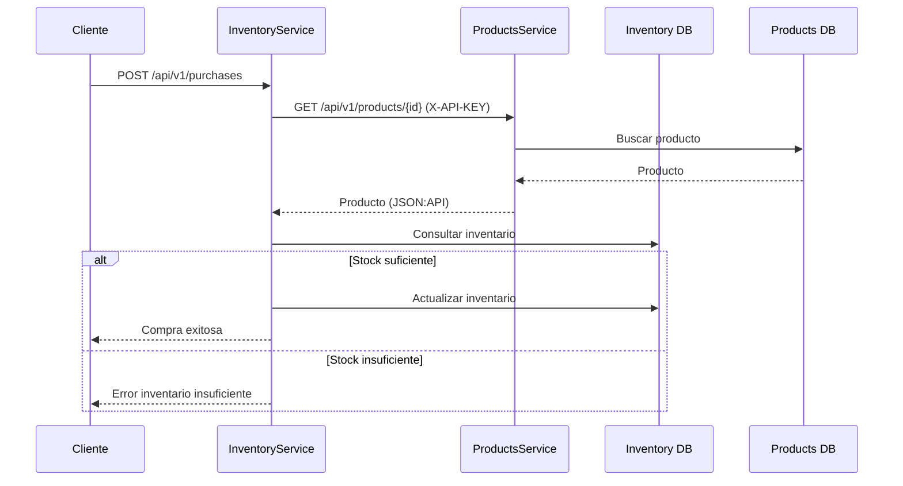

# Prueba Técnica Backend – Java & Spring Boot

## 1. Instrucciones de instalación y ejecución

### Requisitos previos
- Java 17
- Maven (se utiliza Maven Wrapper incluido en el proyecto)
- Docker y Docker Compose
- Git

---

### Clonar el repositorio
```bash
git clone <url-del-repositorio>
cd PruebaBackendJava
```

---

### Levantar entorno
La solución está completamente containerizada usando Docker y Docker Compose.
Cada microservicio cuenta con su propio Dockerfile y su propia base de datos PostgreSQL

Para levantar el entorno:

```bash
docker compose up -d
```

Esto levanta los siguientes contenedores:
- **products_db**  BAse de datos PostgreSQL de ProductsService
- **inventory_db**  Base de datos de InventoryService
- **products-service** Microservicio de productos
- **inventory-service** Microservicio de inventario y compras


### Swagger / OpenAPI

Cada microservicio expone documentación

- ProductsService:  
  http://localhost:8081/swagger-ui/index.html

- InventoryService:  
  http://localhost:8082/swagger-ui/index.html

---

## 2. Descripción de la arquitectura

La solución está basada en una **arquitectura de microservicios**, donde cada servicio tiene responsabilidades bien definidas y desacopladas.

### ProductsService
Responsabilidades:
- Creación de productos
- Consulta de productos por ID
- Exposición de información siguiendo el estándar **JSON:API**

Este servicio se considera **interno**, por lo que su acceso está protegido mediante **API Key**.

---

### InventoryService
Responsabilidades:
- Gestión de inventario
- Procesamiento de compras
- Consulta de disponibilidad de productos
- Orquestación de la comunicación con ProductsService

Este servicio concentra la lógica de negocio del proceso de compra.

---

### Comunicación entre servicios
- Comunicación HTTP síncrona
- Uso de `RestClient`
- Autenticación básica mediante API Key
- Manejo de timeout y reintentos básicos

---

## 3. Decisiones técnicas y justificaciones

### Ubicación del endpoint de compra

El endpoint de compra (`POST /api/v1/purchases`) fue implementado en **InventoryService**.

**Justificación:**
- El proceso de compra impacta directamente al inventario
- InventoryService es responsable de validar disponibilidad y actualizar stock
- ProductsService mantiene una única responsabilidad: gestión del catálogo

Esta decisión sigue el principio de **Single Responsibility** y evita acoplar lógica de negocio compleja en el servicio de productos.

---

### Separación de bases de datos
Cada microservicio cuenta con su propia base de datos:
- Evita dependencias entre servicios
- Facilita escalabilidad independiente
- Alineado con buenas prácticas de microservicios

---

### Autenticación entre servicios

Se implementó autenticación básica entre servicios mediante **API Key**:
- Header utilizado: `X-API-KEY`
- ProductsService valida la API Key

Esto restringe el acceso directo al catálogo de productos.

---

### Manejo de errores

- Uso de `@ControllerAdvice` para manejo global de excepciones
- Errores controlados para:
  - Producto no encontrado
  - Inventario insuficiente
  - Errores de comunicación entre servicios

---

## 4. Diagrama de interacción entre servicios



---

## 5. Flujo de compra implementado

1. El cliente envía la solicitud de compra a InventoryService
2. InventoryService consulta ProductsService para validar la existencia del producto
3. InventoryService valida la disponibilidad en su base de datos
4. Si hay stock suficiente:
   - Se descuenta la cantidad
   - Se persiste el cambio
   - Se retorna respuesta exitosa
5. Si no hay stock suficiente:
   - Se retorna un error controlado
6. Si el producto no existe:
   - Se retorna un error desde ProductsService

---

## 6. Uso de herramientas de IA en el desarrollo

Durante el desarrollo se utilizaron herramientas de IA como apoyo técnico.

### Uso específico
- Revisión de estructura de microservicios
- Revisión de buenas prácticas y manejo de errores
- Autocompletado de código

### Verificación de calidad
- Todo el código fue revisado y adaptado manualmente
- Pruebas manuales con Postman
- Análisis de logs y manejo de excepciones

La IA fue utilizada como herramienta de apoyo, para centralizar información, agilizar tiempos,y posibles soluciones
Se utilizaron herramientas de IA como ChatGPT y la IA integrada del editor Visual Studio Code, principalmente como apoyo durante el desarrollo. El código generado o sugerido fue revisado y validado manualmente, aplicando la experiencia adquirida previamente para asegurar su calidad y correcto funcionamiento.
Es importante resaltar que el uso de IA se realizó de forma responsable, no como un reemplazo del criterio técnico, sino como una herramienta para potenciar y agilizar el trabajo, manteniendo siempre el control y la comprensión del código desarrollado.
---


---


